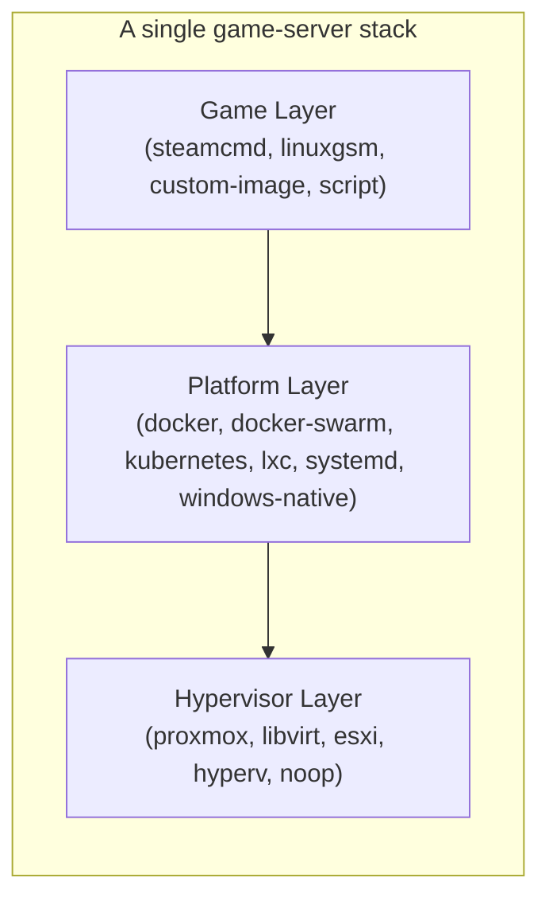
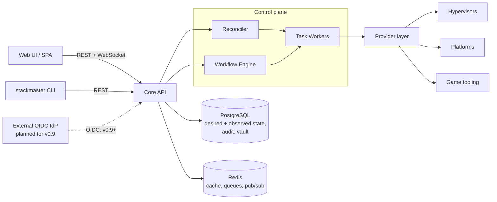
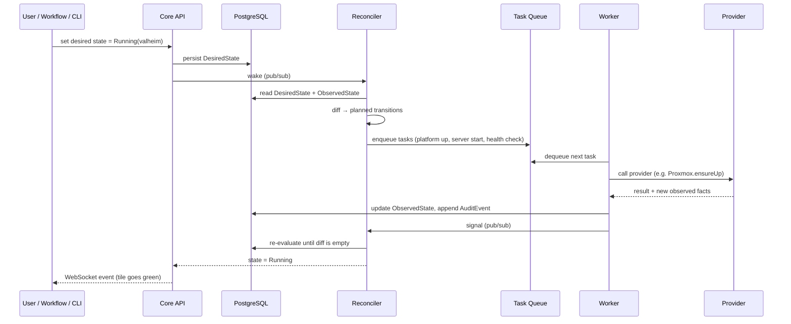
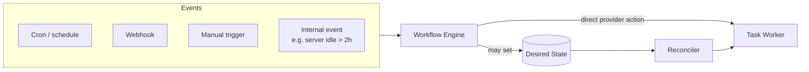
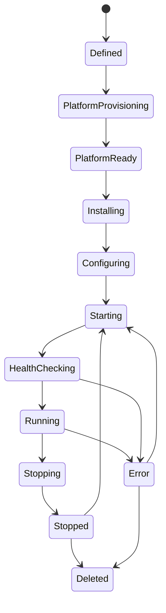
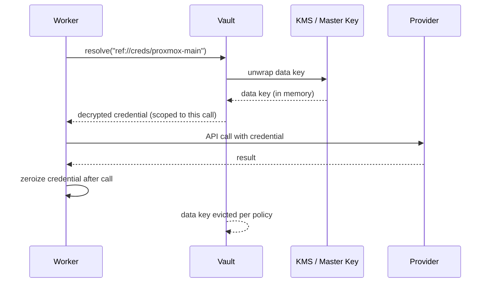
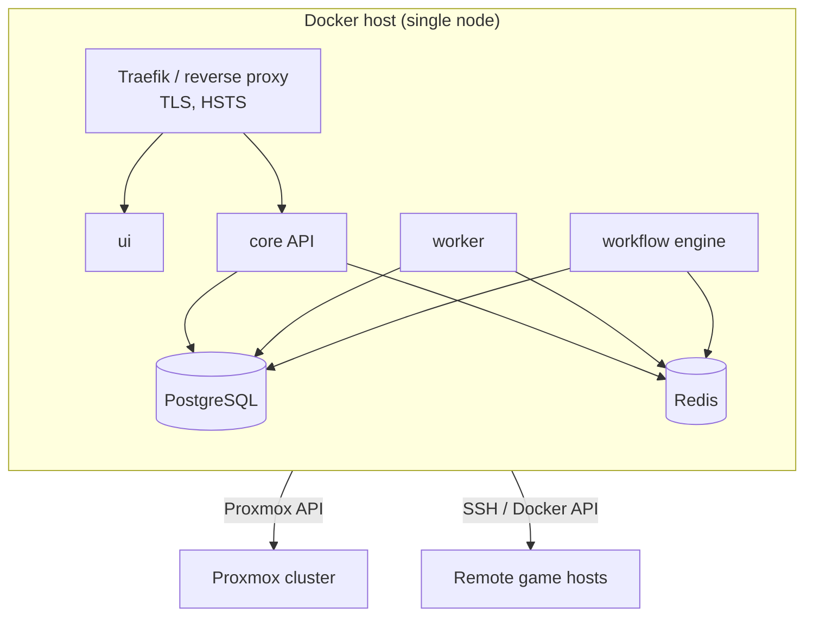
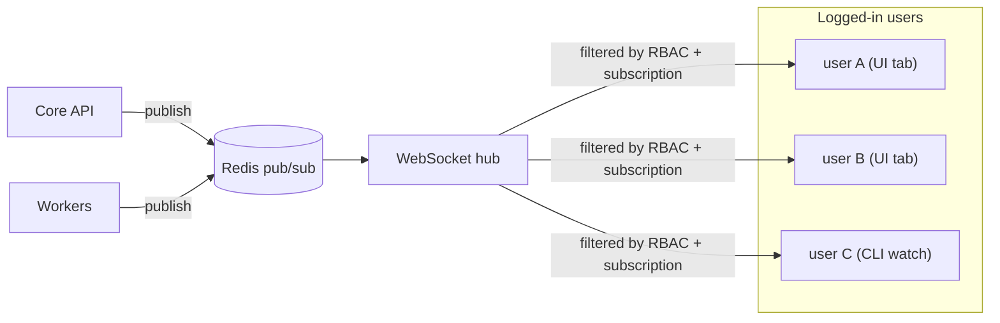

# Architecture

This document describes Stackmaster's components, their responsibilities,
and the data that flows between them. It is intentionally language- and
framework-agnostic: concrete technology choices are deferred to the
[ADRs](adr/).

## 1. The three provider layers

Stackmaster's core abstraction is the **provider**. A provider is a
pluggable adapter that implements a well-defined interface for exactly
one layer of the stack. Every action that touches a real machine goes
through exactly one provider call.

Interfaces (to be refined in [PROVIDERS.md](PROVIDERS.md)):

- `HypervisorProvider` — `ensureUp(host)`, `ensureDown(host)`,
  `snapshot(host)`, `clone(host)`, `status(host)`.
- `PlatformProvider` — `ensureReady(platform)`,
  `deployUnit(unit)`, `startUnit(unit)`, `stopUnit(unit)`,
  `streamLogs(unit)`, `exec(unit, cmd)`.
- `GameProvider` — `install(server)`, `configure(server)`,
  `start(server)`, `stop(server)`, `backup(server)`, `restore(server)`,
  `healthCheck(server)`.

Every provider is **stateless** between calls. All state lives in the
core database. This keeps providers replaceable and testable.

The `noop` hypervisor provider is a first-class citizen — it is the path
for "bare-metal Linux box that is always on". It always reports `up`
and never performs side effects.

## 2. High-level component diagram

### Responsibilities

| Component        | Owns                                                      |
|------------------|-----------------------------------------------------------|
| Core API         | HTTP/WebSocket surface, authn/authz, validation           |
| Reconciler       | "What should be running?" — continuous convergence loop   |
| Workflow Engine  | "What should happen on event X?" — DAG execution          |
| Task Workers     | Execute one provider operation with a timeout & retry     |
| Providers        | Talk to the real world (Proxmox, Docker, SteamCMD, …)     |
| Vault            | Encrypted credentials, field-level, envelope-encrypted    |
| PostgreSQL       | Source of truth: desired state, observed state, audit     |
| Redis            | Ephemeral cache, task queue, WebSocket pub/sub            |

## 3. Reconciler data flow

The reconciler is modeled on Kubernetes controllers.

Key invariants:

- **Desired state is the only write source for intent.** Users never
  issue "start this container now" as an imperative — they set the
  desired state, the reconciler converges.
- **Every task is idempotent** and scoped to one provider call.
- **Failure stays inside the state machine** — a failed health check
  transitions the server to `Error`, not to a logless limbo.

## 4. Reconciler ↔ Workflow Engine relationship

The workflow engine is a **separate** component with a different
question to answer.

| Concern        | Reconciler                          | Workflow Engine                      |
|----------------|-------------------------------------|--------------------------------------|
| Question       | What should be running?             | What should happen on event X?       |
| Model          | Desired vs. observed state diff     | DAG of typed nodes                   |
| Trigger        | Desired state changed, tick, probe  | Schedule, webhook, manual, event     |
| Persistence    | Continuous loop, current diff       | Per-run, resumable after restart     |
| Side effects   | Indirect (enqueue tasks)            | Direct (may also set desired state)  |

Rules:

- Workflows may **read** observed state and **write** desired state.
- Workflows may also call provider actions directly, but only through
  the same task-worker interface the reconciler uses — there is one
  audit trail, one retry policy, one credential path.
- Reconciler never triggers a workflow. The flow is one-way: workflow
  → desired state → reconciler.
- Every workflow run is **persistent**. A restart of the workflow
  engine must be able to resume in-flight runs from the last
  checkpoint (see [ADR-0008](adr/0008-workflow-engine.md)).

## 5. State machine per game server

Every transition is audited and idempotent. See
[STATE_MACHINE.md](STATE_MACHINE.md) for the transition matrix.

## 6. Credential flow

Rules:

- Credentials are referenced by alias or ID. Plaintext never appears in
  UI, logs, or audit events.
- The worker holds decrypted credentials only for the duration of one
  operation.
- Rotation is a first-class feature (see [CREDENTIALS.md](CREDENTIALS.md)).

## 7. API surface

Two transports, one data model:

- **REST/JSON** — CRUD on all resources. OpenAPI definition is the
  source of truth.
- **WebSocket** — live log streams, console passthrough, reconciler
  progress events, UI tile updates.

The UI is a separate SPA that consumes this API. The CLI (`stackmaster`)
speaks the same API. A third-party TUI or mobile client is intended to
be buildable against it without special-casing. See [API.md](API.md).

## 8. Deployment model

### Single-node (the primary v1.0 path)

Installed via `docker compose` from [deploy/](../deploy/). Single
command. One `.env` file. One encrypted backup = one database dump +
one master-key file.

### Multi-node (later)

A Helm chart is planned. The same binaries run:

- `core` as a Deployment behind an Ingress.
- `worker` and `workflow-engine` as Deployments with horizontal
  pods.
- PostgreSQL and Redis as operator-managed or external services.

Multi-node is **not** a v0.1 or v1.0 blocker.

## 9. Boundary rules (the things that must not blur)

- The core **never** imports code from a provider. Providers are
  discovered via a registry and a versioned interface.
- The workflow engine **never** bypasses the task worker to talk to a
  provider directly.
- The UI **never** holds a credential — only references.
- The reconciler **never** signs audit events; the API does, after
  verifying the caller.
- The CLI and the UI are peers; neither may gain a capability the other
  structurally cannot have.

## 10. Real-time UI sync (no page reload)

**Requirement.** Every state-changing action must become visible to
**all** currently-connected users within a bounded latency, without
the user reloading the page. A schedule change, a workflow edit, a
game-server state transition, a new backup, a credential rotation —
all of them broadcast to subscribers in real time.

**Implementation shape:**

Rules:

1. **Every write emits an event.** The API and workers publish a
   typed event on Redis pub/sub whenever persisted state changes.
   Events carry: resource type, resource id, kind of change,
   monotonic sequence id, redacted payload diff. No credential
   plaintext, ever.
2. **Subscriptions are explicit and RBAC-filtered.** A browser tab
   subscribes to the resources it currently displays. The hub
   forwards only events the subscriber is authorized to see — an
   Operator never receives events for a server they cannot access.
3. **Source of truth is the database.** WebSocket events are
   *notifications*; the client re-reads (or uses the payload
   snapshot) against the API's consistent read. This means an event
   lost during a reconnect only causes a re-fetch, not a wrong UI.
4. **Reconnect is first-class.** Clients reconnect with the last
   received sequence id; the hub replays missed events from a
   short-TTL buffer (Redis stream) or tells the client to refetch.
5. **CLI watches use the same channel.** `stackmaster server watch`
   and `stackmaster audit tail` subscribe to the same hub, so
   humans on the CLI and humans in the browser see identical state
   at the same moment.
6. **Latency budget.** Default target: sub-second end-to-end (write
   → subscriber paint) on a single-node deployment. Measured and
   surfaced as a Prometheus metric (post-v0.2).

This principle is non-negotiable: Stackmaster is an operator tool
where two admins may be watching the same incident at once, and
they must see the same world.

## 11. Architectural decisions (see [adr/](adr/))

| ID       | Topic                              | Status                                                                   |
|----------|------------------------------------|--------------------------------------------------------------------------|
| 0001     | Backend language                   | **Accepted — Go**                                                        |
| 0002     | Task queue / workflow runtime      | **Accepted — asynq + custom DAG on Postgres**                            |
| 0003     | Frontend framework                 | **Accepted — React + Vite**                                              |
| 0004     | License                            | **Accepted — AGPL-3.0-or-later**                                         |
| 0005     | Credential vault backend           | **Accepted — internal PostgreSQL (default)**                             |
| 0006     | Auth stack                         | **Accepted — local accounts + env-var bootstrap in v0.1; native OIDC (go-oidc, Authentik primary) deferred to v0.9** |
| 0007     | Node-editor library                | **Accepted — React Flow**                                                |
| 0008     | Workflow engine model              | **Accepted — custom DAG on PostgreSQL**                                  |

With all ADRs accepted, the implementation path for iteration 2 is
clear: Go core + asynq + PostgreSQL + Redis + React/Vite + React
Flow, authenticating via local accounts with an env-var bootstrap
admin. OIDC / external IdP integration is scheduled for v0.9 (see
[ROADMAP.md](ROADMAP.md)); Authentik will be the first conformance
target when that work starts.
