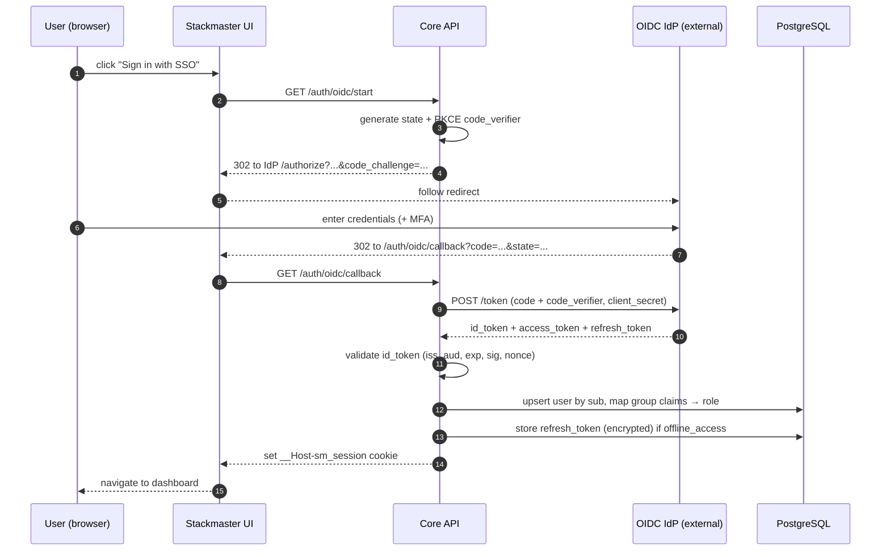

# Authentication

Stackmaster authenticates humans via **local accounts** (the only
path through v0.8) and — starting in v0.9 — via **OpenID Connect**.
Machine clients use **Personal Access Tokens** throughout.

## Sequencing

The auth surface is built in two phases:

- **v0.1 through v0.8 — local accounts only.** An env-var bootstrap
  admin creates itself on first start; that admin creates further
  local users. Every iteration up to v0.9 operates exclusively on
  this path. No OIDC code is in the binary, no OIDC env vars are
  consumed.
- **v0.9 — external IdP (OIDC) integration.** Native OIDC relying
  party is added per [ADR-0006](adr/0006-auth-and-oidc.md). Local
  accounts remain as the permanent fallback so that a broken IdP
  never locks the operator out of their own system. See
  [ROADMAP.md](ROADMAP.md) for exit criteria.

The rest of this document is split the same way: **Current (local
accounts)** first, **Planned (OIDC)** second. When reading in
v0.1–v0.8, treat the OIDC section as a forward-looking design
record, not a description of what is shipping.

## Goals

- **Local-first baseline.** The system is fully usable — including
  role mapping, audit, PATs, and session management — without any
  external identity provider. OIDC is an addition, not a prerequisite.
- **Never an issuer.** Stackmaster is an OIDC relying party only.
  It does not issue OIDC tokens for third parties.
- **IdP is out of scope** (when OIDC ships). Stackmaster does **not**
  bundle, install, or operate an IdP. It is a relying party against
  an IdP the operator already runs. The `deploy/` directory contains
  no Authentik (or Keycloak, or Authelia) service.
- **Group-to-role mapping.** Once OIDC is enabled, administrators
  map IdP group claims to Stackmaster roles — no per-user clickwork
  for bulk provisioning.

---

## Current: local accounts (v0.1–v0.8)

### Bootstrap admin

On first start, if no admin user exists, Stackmaster creates one
from environment variables (decided in
[ADR-0006](adr/0006-auth-and-oidc.md)):

- `SM_BOOTSTRAP_ADMIN_EMAIL`
- `SM_BOOTSTRAP_ADMIN_PASSWORD`

The bootstrap password **must** be changed on first login. The env
vars are read once on first start and then ignored; later starts
with the same values are no-ops. If an admin already exists, the
env vars are silently ignored.

### Local login

- Passwords hashed with **Argon2id** (m=64MiB, t=3, p=1 as a
  starting point; tuned per deployment).
- Rate-limited login: exponential backoff per IP + per account.
- Account lockout after N failures within a window (configurable;
  always with an audited unlock path).
- All failures audited; successful logins audited with the auth path
  (`local`).

### User management

Administrators create, disable, delete local users and reset
passwords via the UI and the API. Users can change their own
password. See [RBAC.md](RBAC.md) for the exact verbs.

### Role assignment (without IdP group claims)

Until OIDC lands in v0.9, role assignment is explicit: an
Administrator creates a user and assigns them to Administrator or
Operator directly. No group-claim mapping applies because no
external claims exist yet. See [RBAC.md](RBAC.md) for the matrix.

### Personal Access Token (PAT)

- Created by a user in the UI, scoped to a subset of resources.
- Shown to the user **once**; stored hashed (Argon2id).
- Revocable. Listed in the user's profile. Every call with a PAT is
  audited with the token's name.

### Service accounts

- Special user type with no interactive login, only PATs.
- Used by CI, external orchestrators, or the CLI on automation hosts.

---

## Planned: external IdP (OIDC) — v0.9

OIDC is the last major capability before v1.0. The design below is
accepted (see [ADR-0006](adr/0006-auth-and-oidc.md)) but **not yet
implemented**. It lands on top of the local-account surface — it
does not replace it.

### OIDC Authorization Code with PKCE



Notes:

- **PKCE is mandatory** even for confidential clients.
- **State + nonce both verified.**
- **Access tokens are never persisted.** They exist only in the
  request that minted them.
- **Refresh tokens are stored encrypted** in the vault, keyed per
  user, and used only to refresh a session when still in use.

### Connecting an external IdP (v0.9)

Stackmaster does not run an IdP. Point it at an IdP you already
operate (Authentik, Keycloak, Authelia, or any standards-compliant
OIDC provider).

Required configuration on the Stackmaster side (env vars,
introduced in v0.9):

| Variable                 | Meaning                                                        |
|--------------------------|----------------------------------------------------------------|
| `SM_OIDC_ISSUER`         | Issuer URL of the IdP (`iss` claim). TLS required.             |
| `SM_OIDC_CLIENT_ID`      | Client ID registered at the IdP for Stackmaster.               |
| `SM_OIDC_CLIENT_SECRET`  | Client secret. Stored only in env / the credential vault.      |
| `SM_OIDC_SCOPES`         | Scopes requested. Default: `openid profile email groups`.      |
| `SM_OIDC_GROUPS_CLAIM`   | Claim name that carries groups. Default: `groups`.             |
| `SM_PUBLIC_URL`          | Stackmaster's public URL. The redirect URI is derived from it. |

Leaving `SM_OIDC_ISSUER` empty keeps OIDC disabled; Stackmaster
falls back to local accounts only. This is the permanent behavior
for any deployment that does not wish to integrate an IdP.

Required configuration on the IdP side (common across providers):

- Application / client of type **OIDC, Authorization Code, PKCE
  enabled, confidential**.
- **Redirect URI:** `${SM_PUBLIC_URL}/auth/oidc/callback`.
- **Logout redirect URI** (optional, for OIDC Back-Channel Logout):
  `${SM_PUBLIC_URL}/auth/oidc/logout`.
- **Scopes** advertised: `openid`, `profile`, `email`, plus a claim
  that carries group membership.
- **Group claim** — must be the same name configured in
  `SM_OIDC_GROUPS_CLAIM`.

#### Authentik (primary conformance target in v0.9)

1. In Authentik, create an **OAuth2/OpenID Provider**:
   - Client type: **Confidential**.
   - Redirect URIs: `${SM_PUBLIC_URL}/auth/oidc/callback`.
   - Signing key: RS256.
   - Scopes: `openid`, `profile`, `email`, `groups` (the built-in
     `groups` scope maps PropertyMappings to a `groups` claim).
2. Create an **Application** and bind it to this provider.
3. Create groups `sm-admins` and `sm-operators` and assign users.
4. Copy the client ID, client secret, and the issuer URL
   (`https://authentik.example.org/application/o/stackmaster/`)
   into Stackmaster's env vars.

#### Keycloak / Authelia / generic OIDC

Same shape as above: client with PKCE, the redirect URI, a group
claim mapper, and `SM_OIDC_*` env vars pointed at the issuer. The
flow is identical — Stackmaster does not carry provider-specific
code.

### Claims mapping (v0.9)

Default mapping (configurable per deployment):

| Source (OIDC claim)   | Target (Stackmaster)              | Example                     |
|-----------------------|-----------------------------------|-----------------------------|
| `sub`                 | Stable user ID                    | IdP-issued subject          |
| `preferred_username`  | Display name                      | `jan`                       |
| `email`               | Email address                     | `jan@example.org`           |
| `email_verified`      | Must be `true`                    |                             |
| `groups` (or custom)  | Role mapping                      | `sm-admins` → Administrator |
| `aud`                 | Must include the configured client|                             |

Group mapping is expressed as a list of rules evaluated top-to-bottom:

```yaml
# example: auth/oidc-mapping.yaml (illustrative)
claims:
  groups: groups
mappings:
  - match: { group: "sm-admins" }
    role: administrator
  - match: { group: "sm-operators" }
    role: operator
  - match: { group: "*" }
    role: operator   # default for any authenticated user
```

---

## Session model (applies to both paths)

- Cookie: `__Host-sm_session` — httpOnly, Secure, SameSite=Strict
  after login. (During the v0.9 OIDC redirect dance, the cookie is
  briefly SameSite=Lax; before v0.9 it is Strict from the first
  login because there is no cross-site redirect.)
- Default idle timeout: 12h. Default absolute timeout: 30d.
- Session rotation on privilege change.
- Logout invalidates the session server-side; OIDC **Back-Channel
  Logout** (OIDC BC logout) supported in v0.9 where the IdP
  advertises it.

## MFA outlook

- Local accounts get **TOTP** as the first-supported second factor
  (post-v0.4).
- From v0.9, MFA can additionally be **delegated to the OIDC IdP**
  — any OIDC flow that enforces MFA at the IdP is honored.
- **WebAuthn** (hardware keys, platform authenticators) is a
  post-v1.0 target.

## Brute force & abuse protection

- Login endpoint rate-limited per IP and per account.
- Progressive delay on failed attempts.
- Account lockout after N failures within a window (configurable;
  always with an audited unlock path).
- All failures audited; successful logins audited with the auth
  path (`local` in v0.1–v0.8; also `oidc:<issuer-alias>` and
  `pat:<name>` from v0.9).

## Headers & cookies (summary)

| Header / Cookie        | Value                                        |
|------------------------|----------------------------------------------|
| `__Host-sm_session`    | httpOnly, Secure, SameSite=Strict            |
| `X-Frame-Options`      | `DENY`                                       |
| `Content-Security-Policy` | strict default-src, to be finalized       |
| `Strict-Transport-Security` | `max-age=63072000; includeSubDomains`   |
| `Referrer-Policy`      | `same-origin`                                |

## TODO

- [ ] Finalize claim mapping config schema (v0.9).
- [ ] Specify the PAT scoping model precisely.
- [ ] Plan WebAuthn integration path.
