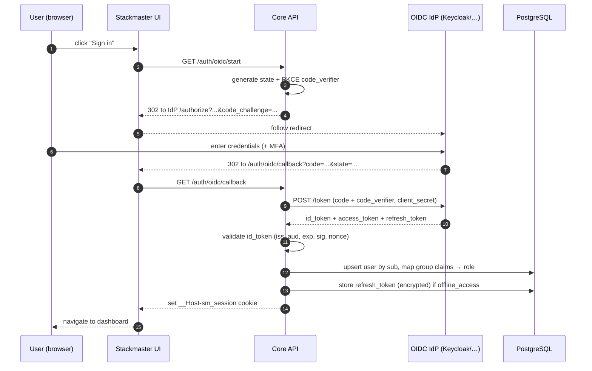

# Authentication

Stackmaster authenticates humans via **OpenID Connect** (primary) and
**local accounts** (baseline and bootstrap). Machine clients use
**Personal Access Tokens**.

## Goals

- **OIDC-first.** Any standards-compliant OIDC provider works.
  **Authentik is the primary conformance target** in CI; Keycloak,
  Authelia, Google, GitHub, and Microsoft Entra ID are part of the
  conformance matrix.
- **IdP is out of scope.** Stackmaster does **not** bundle, install,
  or operate an IdP. It is a relying party against an IdP the
  operator already runs. The `deploy/` directory contains no
  Authentik (or Keycloak, or Authelia) service. This document only
  describes **how to wire Stackmaster to an existing IdP**.
- **Local fallback.** A local admin account always exists so that a
  broken IdP never locks out the operator.
- **Never an issuer.** Stackmaster is an OIDC relying party only.
- **Group-to-role mapping.** Administrators map IdP group claims to
  Stackmaster roles — no per-user clickwork for bulk provisioning.

## Flows

### OIDC Authorization Code with PKCE



Notes:

- **PKCE is mandatory** even for confidential clients.
- **State + nonce both verified.**
- **Access tokens are never persisted.** They exist only in the
  request that minted them.
- **Refresh tokens are stored encrypted** in the vault, keyed per user,
  and used only to refresh a session when still in use.

### Local account (fallback)

- Passwords hashed with **Argon2id** (m=64MiB, t=3, p=1 as a starting
  point; tuned per deployment).
- Rate-limited login: exponential backoff per IP + per account.
- The initial admin account is created during first-run bootstrap
  from environment variables (decided in
  [ADR-0006](adr/0006-auth-and-oidc.md)):
  - `SM_BOOTSTRAP_ADMIN_EMAIL`
  - `SM_BOOTSTRAP_ADMIN_PASSWORD`
  The bootstrap password must be changed on first login. The env
  vars are read once on first start and then ignored; later starts
  with the same values are no-ops.

### Personal Access Token (PAT)

- Created by a user in the UI, scoped to a subset of resources.
- Shown to the user **once**; stored hashed (Argon2id).
- Revocable. Listed in the user's profile. Every call with a PAT is
  audited with the token's name.

### Service accounts

- Special user type with no interactive login, only PATs.
- Used by CI, external orchestrators, or the CLI on automation hosts.

## Connecting an external IdP

Stackmaster does not run an IdP. Point it at an IdP you already
operate (Authentik, Keycloak, Authelia, or any standards-compliant
OIDC provider).

Required configuration on the Stackmaster side (env vars, see
[`deploy/.env.example`](../deploy/.env.example)):

| Variable                 | Meaning                                                        |
|--------------------------|----------------------------------------------------------------|
| `SM_OIDC_ISSUER`         | Issuer URL of the IdP (`iss` claim). TLS required.             |
| `SM_OIDC_CLIENT_ID`      | Client ID registered at the IdP for Stackmaster.               |
| `SM_OIDC_CLIENT_SECRET`  | Client secret. Stored only in env / the credential vault.      |
| `SM_OIDC_SCOPES`         | Scopes requested. Default: `openid profile email groups`.      |
| `SM_OIDC_GROUPS_CLAIM`   | Claim name that carries groups. Default: `groups`.             |
| `SM_PUBLIC_URL`          | Stackmaster's public URL. The redirect URI is derived from it. |

Required configuration on the IdP side (common across providers):

- Application / client of type **OIDC, Authorization Code, PKCE
  enabled, confidential**.
- **Redirect URI:** `${SM_PUBLIC_URL}/auth/oidc/callback`.
- **Logout redirect URI** (optional, for OIDC Back-Channel Logout):
  `${SM_PUBLIC_URL}/auth/oidc/logout`.
- **Scopes** advertised: `openid`, `profile`, `email`, plus a claim
  that carries group membership.
- **Group claim** — must be the same name configured in
  `SM_OIDC_GROUPS_CLAIM`.

### Authentik (primary conformance target)

1. In Authentik, create an **OAuth2/OpenID Provider**:
   - Client type: **Confidential**.
   - Redirect URIs: `${SM_PUBLIC_URL}/auth/oidc/callback`.
   - Signing key: RS256.
   - Scopes: `openid`, `profile`, `email`, `groups` (the built-in
     `groups` scope maps PropertyMappings to a `groups` claim).
2. Create an **Application** and bind it to this provider.
3. Create groups `sm-admins` and `sm-operators` and assign users.
4. Copy the client ID, client secret, and the issuer URL
   (`https://authentik.example.org/application/o/stackmaster/`)
   into Stackmaster's env vars.

### Keycloak / Authelia / generic OIDC

Same shape as above: client with PKCE, the redirect URI, a group
claim mapper, and `SM_OIDC_*` env vars pointed at the issuer. The
flow is identical — Stackmaster does not carry provider-specific
code.

## Claims mapping

Default mapping (configurable per deployment):

| Source (OIDC claim)   | Target (Stackmaster)              | Example                     |
|-----------------------|-----------------------------------|-----------------------------|
| `sub`                 | Stable user ID                    | keycloak sub                |
| `preferred_username`  | Display name                      | `jan`                       |
| `email`               | Email address                     | `jan@example.org`           |
| `email_verified`      | Must be `true`                    |                             |
| `groups` (or custom)  | Role mapping                      | `sm-admins` → Administrator |
| `aud`                 | Must include the configured client|                             |

Group mapping is expressed as a list of rules evaluated top-to-bottom:

```yaml
# example: auth/oidc-mapping.yaml (illustrative)
claims:
  groups: groups
mappings:
  - match: { group: "sm-admins" }
    role: administrator
  - match: { group: "sm-operators" }
    role: operator
  - match: { group: "*" }
    role: operator   # default for any authenticated user
```

## Session model

- Cookie: `__Host-sm_session` — httpOnly, Secure, SameSite=Strict after
  login (Lax only during the OIDC redirect dance).
- Default idle timeout: 12h. Default absolute timeout: 30d.
- Session rotation on privilege change.
- Logout invalidates the session server-side; OIDC **Back-Channel
  Logout** (RFC 8417 / OIDC BC logout) supported where the IdP
  advertises it.

## MFA outlook

- v1.0 supports MFA **delegated to the OIDC IdP** — any OIDC flow
  that enforces MFA at the IdP is honored.
- Local accounts get **TOTP** as the first-supported second factor
  (post-v0.4).
- **WebAuthn** (hardware keys, platform authenticators) is a
  post-v1.0 target.

## Brute force & abuse protection

- Login endpoint rate-limited per IP and per account.
- Progressive delay on failed attempts.
- Account lockout after N failures within a window (configurable;
  always with an audited unlock path).
- All failures audited; successful logins audited with the auth path
  (`oidc:keycloak`, `local`, `pat:<name>`).

## Headers & cookies (summary)

| Header / Cookie        | Value                                        |
|------------------------|----------------------------------------------|
| `__Host-sm_session`    | httpOnly, Secure, SameSite=Strict            |
| `X-Frame-Options`      | `DENY`                                       |
| `Content-Security-Policy` | strict default-src, to be finalized       |
| `Strict-Transport-Security` | `max-age=63072000; includeSubDomains`   |
| `Referrer-Policy`      | `same-origin`                                |

## TODO

- [ ] Finalize claim mapping config schema.
- [ ] Decide the first-run bootstrap UX (ADR-0006).
- [ ] Specify the PAT scoping model precisely.
- [ ] Plan WebAuthn integration path.
