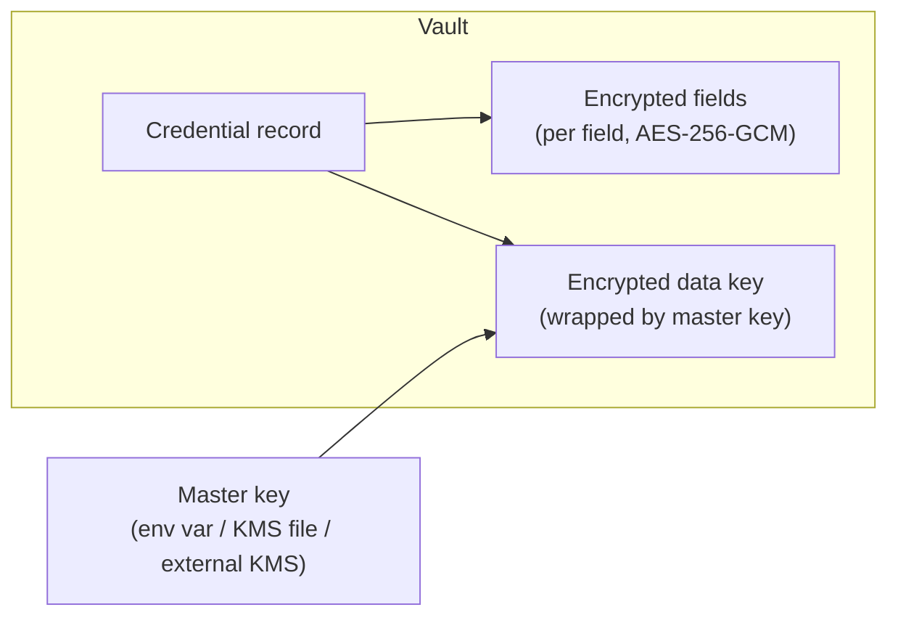

# Credentials

The credential vault is a **first-class subsystem** of Stackmaster, not
a convenience helper. Every secret — from a Proxmox API token to an
SSH key — is stored exactly once, referenced everywhere else, and
decrypted only for the duration of a single operation.

## Design goals

- **Field-level encryption at rest**, not merely column- or
  database-level.
- **Envelope encryption** so that master-key rotation does not require
  re-encrypting every credential.
- **References, not plaintext.** Manifests, workflows, UI forms, and
  audit events carry `ref://…` strings — never the secret.
- **Rotation as a first-class verb** with a clear lifecycle.
- **Pluggable backend** so that the same `get/set/rotate/reference`
  API can resolve against an internal PostgreSQL table, HashiCorp
  Vault, SOPS-encrypted files, or a cloud KMS (see
  [ADR-0005](adr/0005-credential-vault.md)).
- **Memory discipline.** Decrypted secrets are scoped to a single call
  and zeroized after use.

## Credential types (v1.0)

| Type                 | Fields                                              |
|----------------------|-----------------------------------------------------|
| `api_token`          | token, optional scope, optional expiry              |
| `x509`               | cert, key, optional CA chain                        |
| `ssh_key`            | private_key, optional passphrase, optional known_hosts |
| `basic_auth`         | username, password                                  |
| `webhook_secret`     | secret (HMAC key)                                   |
| `oauth_client_secret`| client_id, client_secret, token_endpoint            |
| `kubeconfig`         | kubeconfig (YAML blob), optional context            |
| `cloud_provider`     | provider-specific structured JSON (e.g. AWS access) |

Every credential has, in addition to its type-specific fields:

- `id` (UUIDv7)
- `alias` (unique per workspace; used in `ref://creds/<alias>`)
- `owner_role` (who may edit)
- `consumers[]` (resources that reference it — for blast-radius display)
- `created_at`, `updated_at`, `last_used_at`, `last_rotated_at`
- `encryption_version` (which master key wrapped the data key)
- `state` (`active`, `pending_rotation`, `revoked`)

## Envelope encryption



- **Per-record data key**, AES-256-GCM.
- **Master key wraps the data key** via AES-KW or KMS envelope API.
- The master key source is configurable: `env`, `file`, or an external
  KMS (AWS/GCP/Azure/Vault-Transit). Never in the database.
- Master keys are versioned (`kid`). Records carry `encryption_version`
  to enable online rotation.
- Nonce per field; additional authenticated data binds the record ID
  to the ciphertext so a field cannot be cut-and-pasted into another
  record.

## Rotation

Two rotation verbs, with different meanings:

1. **Data-key rotation (re-wrap).** Triggered on master-key rotation.
   Walks every record, unwraps with the old master key, wraps with the
   new one. Field ciphertexts do not change. Online and incremental.
2. **Credential rotation (real).** Triggered when the underlying
   secret in the outside world changes (new Proxmox token, new SSH
   key). The vault stores the new secret under the same alias and
   transitions the old one through `pending_rotation` → `revoked`.
   A rotation can be coordinated with the provider (e.g. Proxmox:
   call the token-create API, then revoke the old one).

Both rotations are audited. Neither emits plaintext in any log.

## Access paths

- **Workers** call `vault.resolve("ref://creds/proxmox-main")` and
  receive a decrypted credential struct scoped to one operation. The
  worker must zeroize it before returning the task.
- **UI** never resolves references. It shows metadata (alias, type,
  last-used). To change a secret, the user submits a new plaintext
  that is encrypted server-side before touching the database.
- **CLI** `stackmaster apply` sends references in manifests. Plaintext
  is only accepted via `stackmaster credential set <alias>`, which
  pipes over an authenticated, TLS-terminated channel.

## Reference syntax

```
ref://creds/<alias>            # current active version
ref://creds/<alias>@<version>  # pin a specific version (rare)
```

References resolve at worker time, not at manifest-apply time. A
rotation that lands between `apply` and the next reconcile is picked
up transparently.

## Logging and audit

- **Never log plaintext.** Structured logging has a redactor that
  walks known credential struct types before serialization.
- **Audit every resolve.** An audit event records: who (actor),
  which alias, which resource consumed it, at what time, with what
  outcome — but not the value.
- **Surprise resolves** (a resolve from an unexpected consumer) can
  raise an alert (post-v1.0).

## Delegated backends

Behind the same `get/set/rotate/reference` API, three delegated
backends are planned (see [ADR-0005](adr/0005-credential-vault.md)):

- **HashiCorp Vault** (primary delegated backend).
- **SOPS-encrypted files** (gitops-friendly for smaller deployments).
- **Cloud KMS** (master-key hosting; credentials still stored in the
  Stackmaster DB with envelope encryption backed by the KMS).

The *default* backend is the internal PostgreSQL vault. Delegation is
opt-in.

## Schema sketch (illustrative)

```
credentials
  id            uuid pk
  alias         text unique
  type          text
  state         text            -- active | pending_rotation | revoked
  encryption_version  int
  encrypted_data_key  bytea
  encrypted_fields    jsonb     -- { "token": {"ct":..,"nonce":..,"aad":..}, ... }
  owner_role    text
  created_at    timestamptz
  updated_at    timestamptz
  last_used_at  timestamptz
  last_rotated_at timestamptz

credential_consumers
  credential_id  uuid
  consumer_type  text  -- hypervisor | platform | server | workflow
  consumer_id    uuid
  unique(credential_id, consumer_type, consumer_id)

master_keys
  kid           text pk
  source        text  -- env | file | kms:aws | kms:gcp | kms:azure | vault-transit
  created_at    timestamptz
  retired_at    timestamptz nullable
```

## TODO

- [ ] Finalize AEAD choice (AES-GCM vs. XChaCha20-Poly1305) — track
      in ADR-0005.
- [ ] Specify the rotation coordination handshake with each provider.
- [ ] Decide the default key-source for a fresh install.
- [ ] Consider per-user "personal credentials" for Operators who bring
      their own SSH keys.
