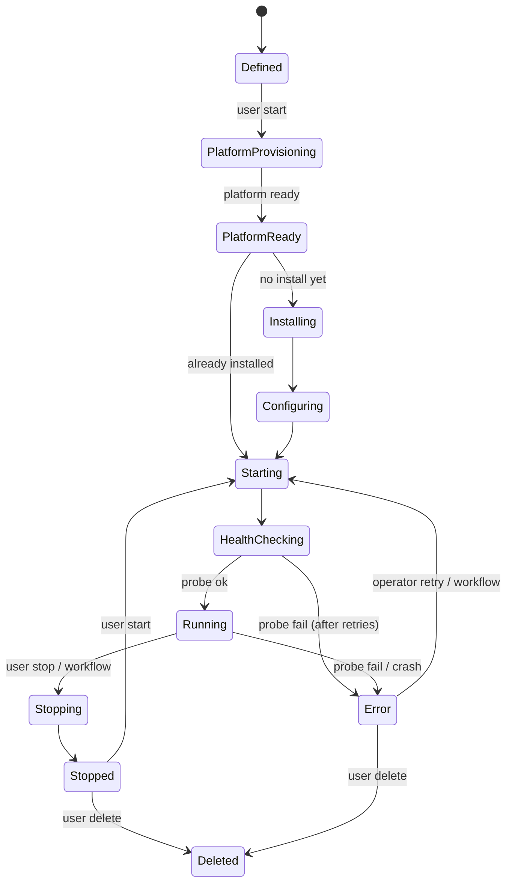

# Game-Server State Machine

Every game server managed by Stackmaster has exactly one state at any
given moment. Every state transition is audited, idempotent, and
driven by either the reconciler or an explicit user action.

## States

| State                  | Meaning                                                          |
|------------------------|------------------------------------------------------------------|
| `Defined`              | Exists in the database. No real resources yet.                   |
| `PlatformProvisioning` | Waiting for platform prerequisites (hypervisor up, daemon ready).|
| `PlatformReady`        | Platform is reachable; game install has not started.             |
| `Installing`           | Game assets being fetched/built.                                 |
| `Configuring`          | Config files, env, ports being materialized.                     |
| `Starting`             | Start command issued; process booting.                           |
| `HealthChecking`       | Process up, waiting for probe to succeed.                        |
| `Running`              | Probe succeeded. Reachable and usable.                           |
| `Stopping`             | Graceful shutdown in progress.                                   |
| `Stopped`              | Process not running. Resources preserved.                        |
| `Error`                | A step failed; requires operator attention or retry policy.      |
| `Deleted`              | Terminal. Resources released; record retained for audit.         |

## Transition matrix

## Transition rules

- **Every transition produces an audit event** with: actor, reason,
  previous state, next state, correlated task ID.
- **Every transition is idempotent.** Re-entering a state is a no-op.
- **The reconciler alone initiates transitions based on diff.** User
  actions write desired state and wake the reconciler; they do not
  call transitions directly.
- **Health checks run on entry to `HealthChecking` and periodically in
  `Running`.** A sustained probe failure moves the server to `Error`.
- **`Error` is a real state, not a log line.** The UI must surface
  which step failed, the last relevant log excerpt, and the suggested
  remediation.
- **`Deleted` is terminal but the row stays** (soft-delete) so the
  audit log keeps referential integrity.

## Guards

| From → To                                     | Guard                                                        |
|-----------------------------------------------|--------------------------------------------------------------|
| `Defined` → `PlatformProvisioning`            | Caller has `gameserver:start` on this server                 |
| `PlatformReady` → `Installing`                | No successful install recorded                               |
| `HealthChecking` → `Running`                  | Probe returned OK within timeout                             |
| `Running` → `Stopping`                        | Caller has `gameserver:stop`                                 |
| anything → `Deleted`                          | Caller has `gameserver:delete` AND no in-flight tasks        |

## Retry & backoff

- Task-level retries: exponential backoff with a per-verb cap (e.g.
  `install` = 3 attempts, `start` = 5 attempts).
- State-level escalation: after N retries, the state moves to `Error`
  rather than continuing to retry forever.
- Retry policy is surfaced in the UI and is configurable per template.

## TODO

- [ ] Finalize the retry table per verb.
- [ ] Decide how `Deleted` interacts with credential references (keep
      the reference so audit stays intact; prevent re-use).
- [ ] Define the migration rules for state-machine changes across
      Stackmaster versions.
