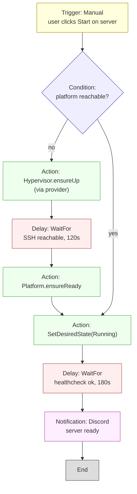

# Workflows

A **workflow** is a directed acyclic graph of typed nodes that
describes an automated operation. Workflows answer the question
"what should happen on event X?". They coexist with the
**reconciler** (which answers "what should be running?") and they
cooperate through desired state or shared task workers — see
[ARCHITECTURE.md](ARCHITECTURE.md).

## Properties

- **Typed nodes** with declared inputs and outputs.
- **Versioned YAML** source of truth. The graphical node editor is a
  view onto the YAML (see [NODE_EDITOR.md](NODE_EDITOR.md)).
- **Persistent and resumable.** A workflow run survives a restart of
  the engine and continues from the last checkpoint.
- **Dry-run mode.** Walks every node without side effects. Every
  Action node must implement its dry-run equivalent.
- **Retry policies per node** and per workflow.
- **Audit-first.** Every run emits a run-start, per-node, and
  run-complete audit event. No silent successes, no silent failures.
- **Idempotent where possible.** The engine prefers "set desired state
  to X" over "issue command Y", because desired state is naturally
  idempotent.

## Node categories

| Category       | Purpose                                      | Examples                                              |
|----------------|----------------------------------------------|-------------------------------------------------------|
| Trigger        | Start a run                                  | Cron, Webhook, Manual, InternalEvent                  |
| Condition      | Branch based on a predicate                  | If, Switch, WaitUntil                                 |
| Action         | Do something in the real world               | SetDesiredState, StartServer, RunWorkflow, Exec       |
| Notification   | Inform humans or systems                     | Email, Slack, Discord, Webhook                        |
| Delay          | Sleep or wait for a condition                | Sleep(duration), WaitFor(probe)                       |
| Parallel       | Fork into parallel branches                  | Parallel(branches=[…])                                |
| ForEach        | Iterate over a collection                    | ForEach(server in group)                              |
| Utility        | Side-effect-free helpers                     | Template, Jq, SetVariable                             |

## Triggers (v1.0)

- **Cron** — schedule using 5-field cron plus timezone.
- **Webhook** — HTTPS endpoint with HMAC signature (HMAC key from the
  vault).
- **Manual** — button in the UI / `stackmaster workflow run <name>`.
- **InternalEvent** — reconciler / core emits events (e.g.
  `gameserver.idle` after configurable inactivity).

Out of scope for v1.0: matrix triggers, git-push triggers.

## Example DAG

The canonical use case: "wake on demand".



## YAML schema (illustrative)

```yaml
apiVersion: stackmaster.io/v1alpha1
kind: Workflow
metadata:
  name: wake-on-demand
  description: Boot the VM if off, start the server, notify on ready.
  tags: [operator-invocable]

spec:
  version: 1

  inputs:
    server:
      type: ref
      kind: gameserver

  triggers:
    - id: manual
      type: Manual
    - id: on-request
      type: InternalEvent
      event: gameserver.start-requested

  retry:
    default:
      max_attempts: 3
      backoff: exponential
      max_delay: 2m

  nodes:
    - id: check-platform
      type: Condition
      expression: "server.platform.reachable"

    - id: boot-host
      type: Action
      action: Hypervisor.ensureUp
      params:
        host: "${{ server.platform.hypervisor }}"

    - id: wait-ssh
      type: Delay
      waitFor:
        probe: ssh
        host: "${{ server.platform.hypervisor }}"
        timeout: 2m

    - id: platform-ready
      type: Action
      action: Platform.ensureReady
      params:
        platform: "${{ server.platform }}"

    - id: mark-running
      type: Action
      action: SetDesiredState
      params:
        target: "${{ server }}"
        state: Running

    - id: wait-health
      type: Delay
      waitFor:
        probe: healthcheck
        server: "${{ server }}"
        timeout: 3m

    - id: notify
      type: Notification
      channel: "ref://creds/discord-webhook"
      template: "Server {{ server.name }} is ready."

  edges:
    - from: check-platform
      to: boot-host
      when: "result == false"
    - from: check-platform
      to: mark-running
      when: "result == true"
    - [ boot-host, wait-ssh ]
    - [ wait-ssh, platform-ready ]
    - [ platform-ready, mark-running ]
    - [ mark-running, wait-health ]
    - [ wait-health, notify ]
```

See [examples/workflows/wake-on-demand.yaml](../examples/workflows/wake-on-demand.yaml)
for the fully commented working example.

## Graph ↔ YAML isomorphism

- Every node in the editor has a 1:1 mapping to a node entry in YAML.
- Every edge has a 1:1 mapping to an entry in `edges`.
- Free-form layout metadata (positions, colors) is stored under
  `metadata.editor` and ignored by the engine.
- A workflow imported from YAML and exported again is byte-identical
  up to key order within a map.

See [NODE_EDITOR.md](NODE_EDITOR.md) for the editor side.

## Runs

- A workflow run has a UUIDv7 ID and is persisted.
- Each node execution has its own record with start, end, status,
  input snapshot, output snapshot, retry count.
- Runs are resumable: a restart of the workflow engine picks up
  in-flight runs from the last completed node.
- Runs can be **canceled**. Cancellation is cooperative: Action nodes
  receive a cancel signal and decide how to stop cleanly.

## Dry-run

- A dry-run annotates every node with what it **would** do, without
  calling providers.
- `SetDesiredState` nodes in dry-run mode record the target state but
  do not write to the database.
- Notifications are suppressed.

## Templates

Built-in templates ship in [`workflows/builtin/`](../workflows/builtin/)
as `*.example.yaml`. Administrators **clone** them into their own
workflows; the templates themselves are read-only. This avoids the
"my install diverged from upstream and now an update broke my
workflow" class of problem.

## TODO

- [ ] Finalize the expression language used in `when:` and `${{ }}`.
- [ ] Specify the event envelope for InternalEvent triggers.
- [ ] Decide how to surface partial failure in ForEach nodes.
- [ ] Settle on a cron library and timezone semantics (see ADR-0002,
      ADR-0008).
